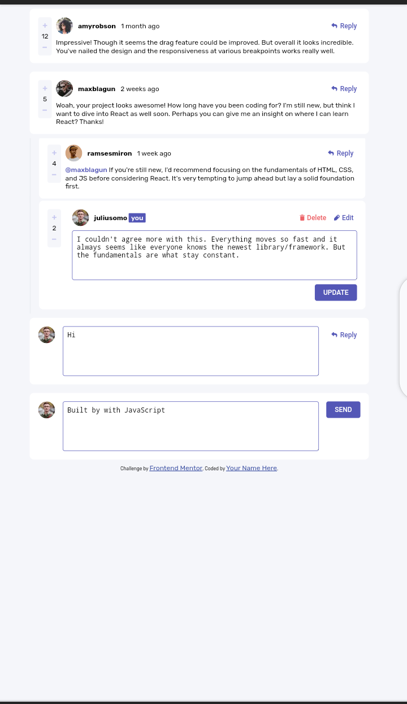

  # Frontend Mentor - Interactive comments section solution
  
  This is a solution to the [Interactive comments section challenge on Frontend Mentor](https://www.frontendmentor.io/challenges/interactive-comments-section-iG1RugEG9). Frontend Mentor challenges help you improve your coding skills by building realistic projects. 
  
  ## Table of contents
  
  - [Overview](#overview)
    - [The challenge](#the-challenge)
    - [Screenshot](#screenshot)
    - [Links](#links)
  - [My process](#my-process)
    - [Built with](#built-with)
    - [What I learned](#what-i-learned)
    - [Continued development](#continued-development)
    - [Useful resources](#useful-resources)
  - [Author](#author)
  
  ## Overview
  
  ### The challenge
  
  Users should be able to:
  
  - View the optimal layout for the app depending on their device's screen size
  - See hover states for all interactive elements on the page
  - Create, Read, Update, and Delete comments and replies
  - Upvote and downvote comments
  - **Bonus**: If you're building a purely front-end project, use `localStorage` to save the current state in the browser that persists when the browser is refreshed.
  - **Bonus**: Instead of using the `createdAt` strings from the `data.json` file, try using timestamps and dynamically track the time since the comment or reply was posted.
  
  ### Screenshot
  
  
  
  ### Links
  
  - Solution URL: [Click here for frontendmentor Solution site ](https://your-solution-url.com)
  - Live Site URL: [Click here to view live site](https://alloyc.github.io/interactive-comments-section-main/)
  
  ## My process
  
  ### Built with
  
  - Semantic HTML5 markup
  - CSS custom properties
  - Flexbox
  - CSS Grid
  - Mobile-first workflow
  - javascript
  
  ### What I learned
  
  This project have really helped me increase my knowledge of javascript. Working with fetch api, localStorage and json file have challenged me by building my mindsite toward javascript algorithms. I learned why pages refreshs when data is submitted to a database and how to prevent html tags from running when inputted by a user in an input/ textarea tag dynamically added to te DOM using javascript innerHTML. Also I finally used javascript splice method, callback function and ReGex in a real project.
  
  ```js
  tweetsOutput += `
      <p class="content"></p>
      
      <div id="create-comment" class="create-replies bg-light">
        
        <textarea class="textarea" name=""  rows="5" placeholder="Add a comment..."></textarea>
        <button class="send cl-light bg-blue fw-500">SEND</button>
      </div>
    `
    tweets.style.display = 'none';
      tweets.innerHTML = tweetsOutput;
      document.querySelector(`#comments-${index} .container .content`).innerText = document.querySelector('.textarea').value;
  ```
  
  ### Continued development
  
  I made use of a lot of nexted if statement as I'm not quite comfortable with switch statement.I would be learning more on switch statement inorder to up my javascript conditioning game😁.
  
  ### Useful resources
  
  - [w3schools](https://www.w3schools.com) - w3schools really helped understand many javascript concept during this project. It is a very resourceful website to learning to code.
  - [stackoverflow](https://www.stackoverflow.com) - stackoverflow is my go to website when i get really stuck on a particular code. It has a lot of solution to problems you'll probabily face during coding. It's a really helpful site.
  - [freeCodeCamp](https://www.freecodecamp.org/learn) - I learnt a lot about coding from freeCodeCamp.  
  
  ## Author
  
  - Frontend Mentor - [@AlloyC](https://www.frontendmentor.io/profile/AlloyC)
  - Twitter - [@jonnyAlloy](https://www.twitter.com/jonnyAlloy)
